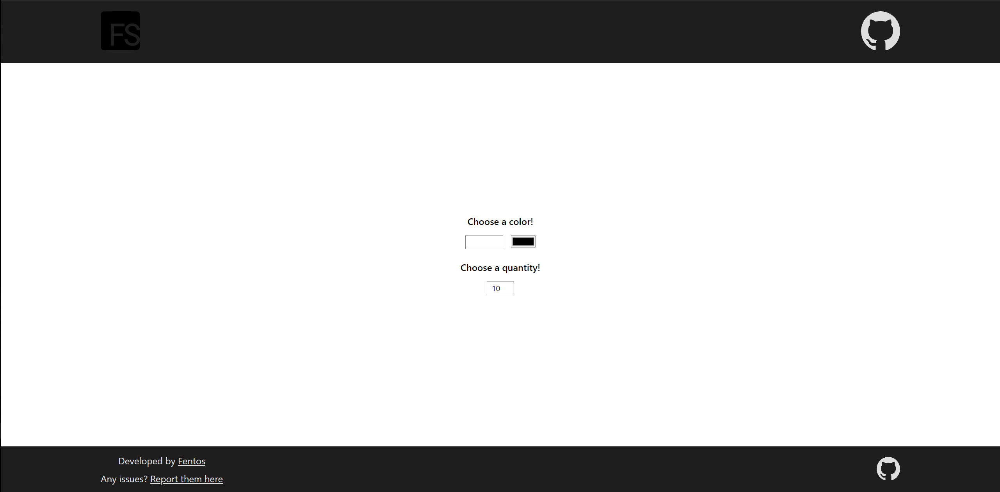
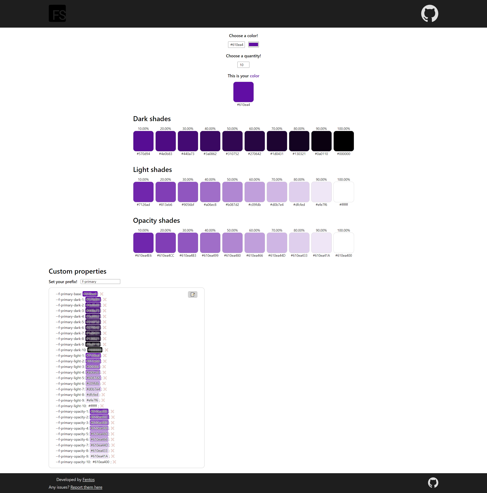
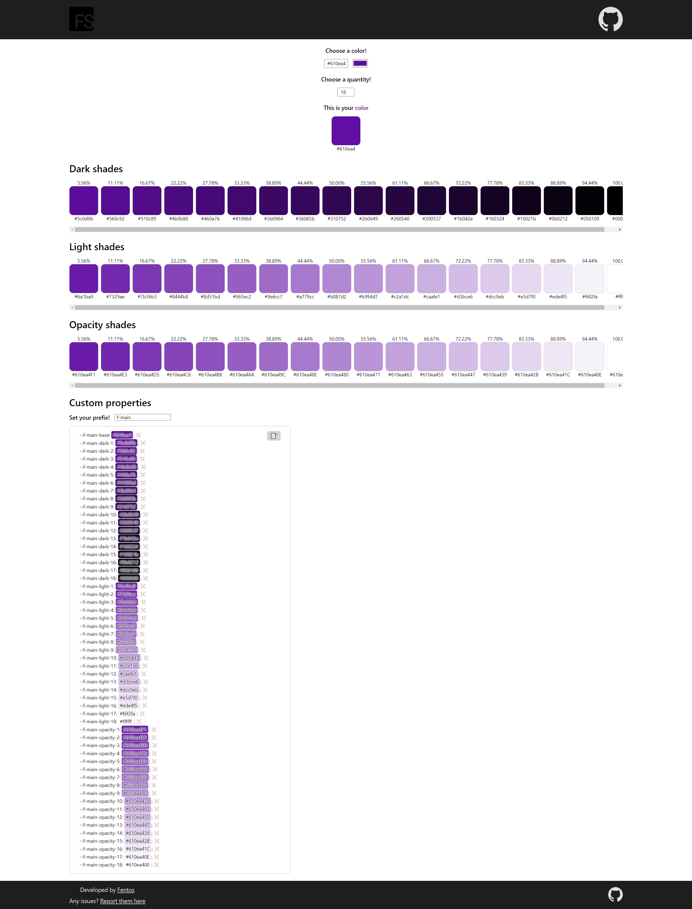

#  Dark, light and opacity shades

### 🎨 Just select your color

### ⚙ Modify the prefix and the number of steps

### 📝 You can copy the color you want (just click on it!). Also, you can copy all the custom properties with your desired prefix, or delete ❌ unnecessary ones

## What is the purpouse of this project?

I just created this web cause I was calculating shades with manual methods or external generators.

I needed the 3 calculations and a list of custom properties in order to save some time creating colors palettes.

## Credits

- Thanks to [Michael Edelstone](https://github.com/edelstone) for calculating colors accurately.
